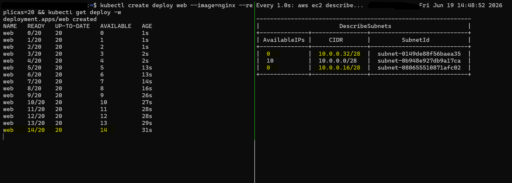
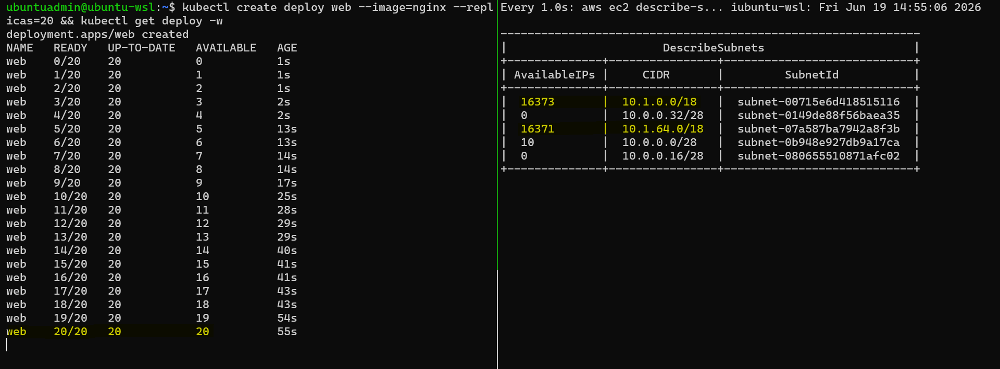

# EKS Runbook: IP Exhaustion Mitigation

## Challenge

As application workloads grow, increasing pod density can consume available subnet IP capacity. In Amazon EKS, IP exhaustion can cause pod scheduling failures, limit cluster scalability, and create availability risks during workload expansion.

> How can pod IP exhaustion in Amazon EKS be mitigated without causing downtime to existing workloads?

- **Project Goal**
  - Build a reproducible EKS lab that simulates pod IP exhaustion.
  - Develop a practical zero-downtime mitigation strategy using `Enhanced Subnet Discovery`.

---

## Mitigation with `Subnet Discovery`

- `Enhanced Subnet Discovery`
  - Provides a streamlined network configuration option for mitigating IP exhaustion.
  - Tags new subnets so they can be discovered by the `Amazon VPC CNI`.

- **Benefits**:
  - Existing workloads can keep running on the same subnets and the same `Amazon Elastic Kubernetes Service (Amazon EKS)` cluster.
  - Additional pods can be scheduled on the new usable subnet(s).

- **Limitation**:
  - Cluster health warnings may still exist because IP exhaustion remains in the original subnets.

---

- **Key Steps:**
  - Set the `ENABLE_SUBNET_DISCOVERY` configuration of the Amazon VPC CNI add-on to `true`.
    - It is enabled by default in VPC CNI versions later than `1.18.0`.

  - Associate a new CIDR block with the `VPC`.
  - Create a new subnet in the new CIDR block and tag it with `"kubernetes.io/role/cni" = "1"`.

---

## Outcome

- **IP Exhaustion**: pods cannot scale.

- Mitigation:
  - Additional subnet.
  - Pod scaling restored.

---

## Best Practices

- Cluster Creation:
  - Use `IPv6` where appropriate.
  - Optimize the IP `warm pool`.
  - Optimize node-level IP consumption with `Prefix Delegation`.

- On-the-fly Mitigation:
  - Enable `Enhanced Subnet Discovery`.

- Remediation:
  - Migrate with `Custom Networking` within the same VPC.

- Observability:
  - Monitor metrics with `cni-metrics-helper`.
  - Set `CloudWatch alarms` for notifications.

---

## Detailed Document

- [AWS Official Documentation Note](./docs/aws_doc.md)
- [Step 1: Create `EKS` with limited IP `CIDR`](./docs/01_infra.md)
- [Step 2: Deploy application exhausting IP pool](./docs/02_ip_exhaust.md)
- [Step 3: Mitigation with `Subnet Discovery`](./docs/03_vpc_cni.md)
