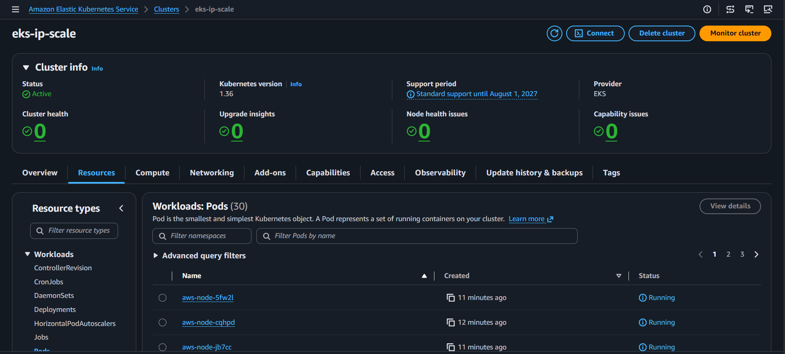

# Runbook: EKS IP Exhaustion - Create EKS

[Back](../README.md)

- [Runbook: EKS IP Exhaustion - Create EKS](#runbook-eks-ip-exhaustion---create-eks)

---

```sh
terraform -chdir=infra init --backend-config=backend.hcl -reconfigure
terraform -chdir=infra fmt
terraform -chdir=infra validate
terraform -chdir=infra apply -auto-approve
terraform -chdir=infra destroy -auto-approve

aws eks update-kubeconfig --region ca-central-1 --name eks-ip-scale
# Added new context arn:aws:eks:ca-central-1:099139718958:cluster/eks-ip-scale to /home/ubuntuadmin/.kube/config

kubectl get nodes -o wide
# NAME                                         STATUS   ROLES    AGE     VERSION               INTERNAL-IP   EXTERNAL-IP   OS-IMAGE                        KERNEL-VERSION                           CONTAINER-RUNTIME
# ip-10-0-0-20.ca-central-1.compute.internal   Ready    <none>   2m13s   v1.36.1-eks-0de9cde   10.0.0.20     <none>        Amazon Linux 2023.12.20260608   6.18.33-63.124.amzn2023.x86_64 (amd64)   containerd://2.2.4+unknown
# ip-10-0-0-23.ca-central-1.compute.internal   Ready    <none>   2m11s   v1.36.1-eks-0de9cde   10.0.0.23     <none>        Amazon Linux 2023.12.20260608   6.18.33-63.124.amzn2023.x86_64 (amd64)   containerd://2.2.4+unknown
# ip-10-0-0-36.ca-central-1.compute.internal   Ready    <none>   2m15s   v1.36.1-eks-0de9cde   10.0.0.36     <none>        Amazon Linux 2023.12.20260608   6.18.33-63.124.amzn2023.x86_64 (amd64)   containerd://2.2.4+unknown
# ip-10-0-0-45.ca-central-1.compute.internal   Ready    <none>   2m16s   v1.36.1-eks-0de9cde   10.0.0.45     <none>        Amazon Linux 2023.12.20260608   6.18.33-63.124.amzn2023.x86_64 (amd64)   containerd://2.2.4+unknown

aws ec2 describe-subnets --filters "Name=tag:Project,Values=eks-ip-scale" --query "Subnets[*].{SubnetId:SubnetId,CIDR:CidrBlock,AvailableIPs:AvailableIpAddressCount}" --output table

# --------------------------------------------------------------
# |                       DescribeSubnets                      |
# +--------------+----------------+----------------------------+
# | AvailableIPs |     CIDR       |         SubnetId           |
# +--------------+----------------+----------------------------+
# |  10          |  10.0.0.0/28   |  subnet-0b948e927db9a17ca  |
# |  6           |  10.0.0.16/28  |  subnet-080655510871afc02  |
# |  4           |  10.0.0.32/28  |  subnet-0149de88f56baea35  |
# +--------------+----------------+----------------------------+
```

| Subnet                 | Total usable | Consumed | AvailableIPs |
| ---------------------- | ------------ | -------- | ------------ |
| Private A 10.0.0.16/28 | 16           | 9        | 6            |
| Private B 10.0.0.32/28 | 16           | 12       | 4            |

---


