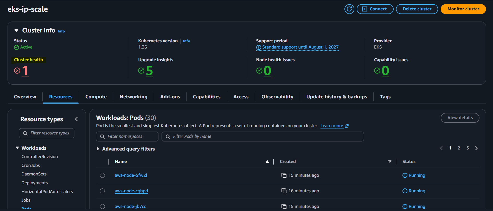
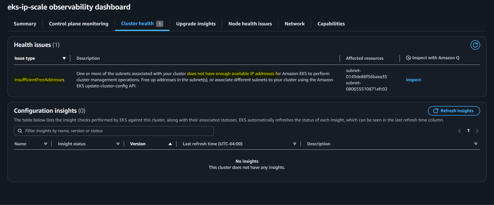

# Runbook: EKS IP Exhaustion - IP Exhaustion

[Back](../README.md)

- [Runbook: EKS IP Exhaustion - IP Exhaustion](#runbook-eks-ip-exhaustion---ip-exhaustion)
  - [Scale out application](#scale-out-application)
  - [Health Issue](#health-issue)

---

## Scale out application

```bash
kubectl create deploy web --image=nginx --replicas=0
# deployment.apps/web created

kubectl scale deploy web --replicas=20
# deployment.apps/web scaled

kubectl get deploy
# NAME   READY   UP-TO-DATE   AVAILABLE   AGE
# web    14/20   20           14          85s

aws ec2 describe-subnets --filters "Name=tag:Project,Values=eks-ip-scale" --query "Subnets[*].{SubnetId:SubnetId,CIDR:CidrBlock,AvailableIPs:AvailableIpAddressCount}" --output table

# --------------------------------------------------------------
# |                       DescribeSubnets                      |
# +--------------+----------------+----------------------------+
# | AvailableIPs |     CIDR       |         SubnetId           |
# +--------------+----------------+----------------------------+
# |  0           |  10.0.0.32/28  |  subnet-0149de88f56baea35  |
# |  10          |  10.0.0.0/28   |  subnet-0b948e927db9a17ca  |
# |  0           |  10.0.0.16/28  |  subnet-080655510871afc02  |
# +--------------+----------------+----------------------------+

kubectl get po -l app=web | grep ContainerCreating
# web-7887448d46-2pk6w   0/1     ContainerCreating   0          91s
# web-7887448d46-9kksd   0/1     ContainerCreating   0          91s
# web-7887448d46-9xwwf   0/1     ContainerCreating   0          91s
# web-7887448d46-jrpwp   0/1     ContainerCreating   0          91s
# web-7887448d46-wlw29   0/1     ContainerCreating   0          91s
# web-7887448d46-wn2gt   0/1     ContainerCreating   0          91s

kubectl describe po web-7887448d46-2pk6w
# Events:
#   Type     Reason                  Age   From               Message
#   ----     ------                  ----  ----               -------
#   Normal   Scheduled               110s  default-scheduler  Successfully assigned default/web-7887448d46-2pk6w to ip-10-0-0-45.ca-central-1.compute.internal
#   Warning  FailedCreatePodSandBox  7s    kubelet            Failed to create pod sandbox: rpc error: code = Unknown desc = failed to setup network for sandbox "42a4b5a58eeaa5574ce0d67158a61d9f9c39107db008a0cd78c241061e6e8b50": plugin type="aws-cni" name="aws-cni" failed (add): add cmd: failed to assign an IP address to container
```

- Observation:
  - Each pod in EKS with the AWS VPC CNI requires a VPC IP from the worker node subnets.
  - Both private subnets reached `AvailableIpAddressCount = 0`.
  - The deployment reached only `14/20` available replicas.
  - The remaining pods stayed in `ContainerCreating` because the AWS CNI failed to assign pod IPs.
  - The events confirm the root cause: `failed to assign an IP address to container`.

---

## Health Issue





```sh
aws eks describe-cluster --name eks-ip-scale --query "cluster.health"
# {
#     "issues": [
#         {
#             "code": "InsufficientFreeAddresses",
#             "message": "One or more of the subnets associated with your cluster does not have enough available IP addresses for Amazon EKS to perform cluster management operations. Free up addresses in the subnet(s), or associate different subnets to your cluster using the Amazon EKS update-cluster-config API.",
#             "resourceIds": [
#                 "subnet-0149de88f56baea35",
#                 "subnet-080655510871afc02"
#             ]
#         }
#     ]
# }

```

---
